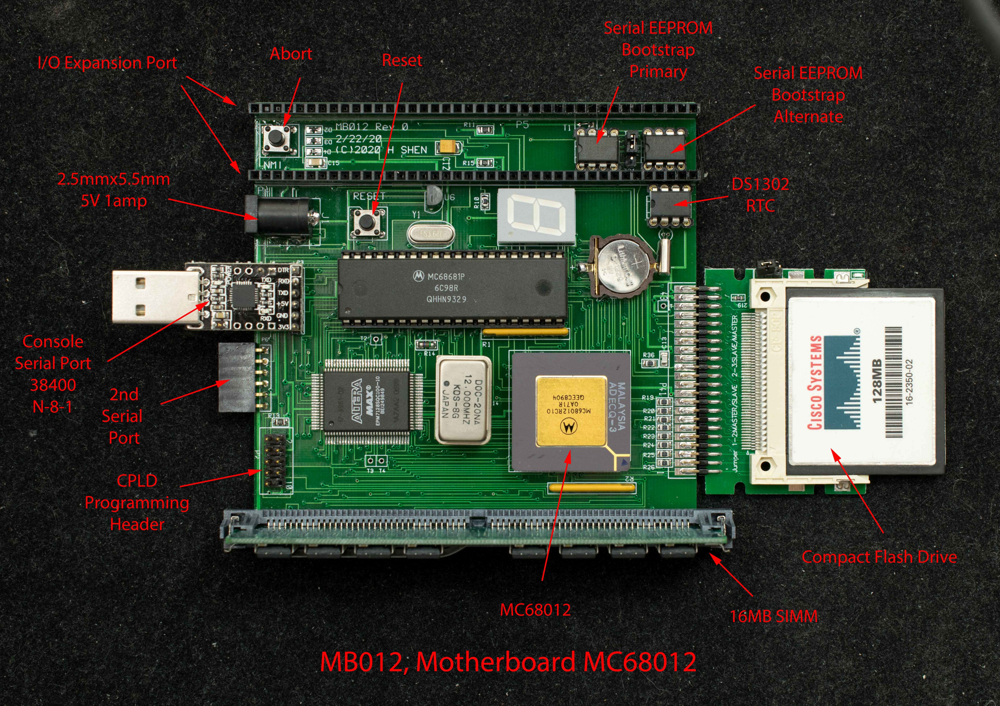

# MB012
MB012 is derived from Tiny68K where the 68000 DIP is replaced with 68012 PGA package. The space thus saved is used for 2 I/O expansion connectors.

### Features
- Design derived from Tiny68K
- MC68012 in PGA package
- 16 meg DRAM
- Duart serial port, MC68681
- Two I/O expansion bus
- Real time clock with battery backup

### Design Information
- [Schematic](mb012_rev0_scm.pdf)
- [Gerber photoplots](mb012_rev0_gerber.zip)
- [CPLD](mb012_rev0_cpld_design_files.zip) design files

### Software
- MB012 monitor

### Instructions
- Creating new CF disk
- Getting Started with MB012
